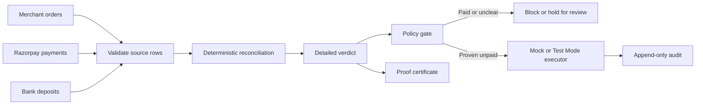

# Ledger Daemon

**Ledger Daemon tells a finance team which orders are paid, unpaid, or need review before anyone follows up.** It compares merchant orders, Razorpay payments, and bank deposits; keeps the records behind each result; and holds uncertain cases for a person. The point is simple: do not chase a customer who has already paid.

[**Try the website**](//jayatiahuja.github.io/razorpay-hack/) · [**Open the full sample controller**](//jayatiahuja.github.io/razorpay-hack/demo.html)

The website is a saved synthetic sample. The local app processes a fresh synthetic batch or a supplied three-file batch and records reviews locally.

**Published synthetic result:** **96.8% (484/500) verdict accuracy**, **100.0% (100/100) double-chase prevention (DCPR)**, **4.0% (2/50) false holds among genuinely unpaid orders**, and **₹0 wrong chase**. These are offline results from seed 42, not results from a merchant account. The full provenance, command, artifacts, and limitations are in [CLAIMS.md](CLAIMS.md).

Synthetic demo and metrics. It uses a mock executor; no credentialed Razorpay Test Mode API run or payment-link creation is included.

Razorpay AI Buildathon 2026 · **Track 04, AI Finance Controller**. Recovery is presented only as **Downstream Control Demonstration: Why Correct Reconciliation Matters**: correct reconciliation stops an unnecessary customer follow-up before it starts.

## The 60-second judge path

1. Open [**Try the website**](//jayatiahuja.github.io/razorpay-hack/), click **Try the sample demo**, and inspect a result proof or change one paise in its temporary copy.
2. Open the [**full sample controller**](//jayatiahuja.github.io/razorpay-hack/demo.html) and visit **Sources**, **Chase list**, **Exceptions**, and **Evaluation**. This is a saved sample, so it does not write anything.
3. In a terminal, run the judge command below. It generates the evidence itself, tries declared failure cases, checks proofs independently, and exits nonzero if a safety invariant fails.

```bash
python -m ledger_daemon judge --seed 42 --n 500 --out out/judge
```

Expect `summary.json`, `cases.jsonl`, `attacks.json`, `latency.json`, `proof-manifest.json`, and `claims.md` under `out/judge`. The committed reference run has fingerprint `45583b83cbff6bd0`; timing varies by machine. The run covers eight synthetic profiles and records 11 declared attack checks. The important judge-facing numbers are the clean profile’s **484/500**, **100/100**, **2/50**, and **₹0** above.

## What it does

Finance teams often have three partially overlapping views of the same money:

- the merchant’s order book says what is due;
- Razorpay captures say what a customer paid through the gateway; and
- the bank statement says what reached the account.

Ledger Daemon validates each file, compares all three, and gives each order a detailed verdict. The interface summarizes those verdicts in plain language as **Paid**, **Unpaid**, or **Needs review**. An unpaid order can enter the chase queue only after the policy gate allows it. A paid or unclear order is blocked or held, with the source rows and rule shown to the reviewer.

The matcher first looks for exact payment references, then exact net settlement amounts within a T+0 to T+3 window, then split settlements, and finally uses narration scoring only when the amount already agrees. If the evidence is not strong enough, it abstains. “Needs review” is a result, not a silent guess.



The diagram describes shipped behavior. Reconciliation is deterministic; policy has the final say; an executor is reached only for a proven unpaid order. The local screen lets a reviewer resolve a case as payment received or nothing arrived, with that resolution added to the audit history.

## Run locally

Requires Python 3.11 or newer. The core demo uses only the standard library and works offline.

```bash
python -m pip install -e .
python -m ledger_daemon ui
```

Open the address printed by the command (normally port 7042). It creates a synthetic sample, provides the full local controller, lets you inspect a result proof/supporting records, and records human review decisions in a local SQLite audit trail.

For a reproducible command-line run without the broader judge suite:

```bash
python -m ledger_daemon demo --seed 42 --n 500 --out out
```

For automated checks after installing the optional development dependency:

```bash
python -m pip install -e ".[dev]"
python -m pytest
```

## Evidence, controls, and the published metrics

Every amount is handled as integer paise. A proof certificate binds the source rows used for a verdict, amount terms, rule IDs, configuration, and calibration identity with SHA-256. The independent verifier recomputes the claim from the source files; it detects changes to exported evidence but cannot prove source systems are truthful. A hash therefore makes a changed export evident, not a substitute for a bank, gateway, or statutory audit.

The policy is deliberately conservative. Missing bank coverage, a duplicate reference, a tie, or weak narration evidence can hold an order. That protects customers but can delay a valid collection action. In the cited clean synthetic batch, two of fifty genuinely unpaid orders were held because the relevant bank-feed window was incomplete. That is the reported 4% false-hold rate and must be read beside the 100/100 DCPR.

| capability | external object / side effect | moves money? | model involved? |
|---|---|---:|---|
| reconciliation and proof verification | none | no | no |
| human resolution | local audit record | no | no |
| published demo executor | local mock records | no | no |
| Test Mode payment link | External object / side effect | Does not move money | no |

The executor’s audit key is derived from order, action, and attempt, so the database rejects duplicate actions. Validation failures go to a masked, append-only quarantine journal. Local source files, proofs, audit data, and drafts remain in the selected output directory. Test Mode keys are read from the environment and live-mode keys are rejected; keys are not written to the audit trail or proof bundle.

## What is real and what is simulated

**Synthetic metrics:** The published 96.8%, 484/500, 100/100 DCPR, 4%, 2/50, and ₹0 figures come from generated data whose labels are written at injection time. They demonstrate implementation behavior where truth is known. They do not establish accuracy on a real merchant ledger.

**Website:** The Pages site is a static, saved synthetic sample. It can show saved proofs and a recorded command result, but it cannot run a new reconciliation or save a review.

**Local app:** It runs a fresh synthetic batch by default. It can also reconcile a complete imported batch containing orders, gateway captures, and bank records. An imported file is not ground truth, so it does not produce an accuracy metric.

**Bank-import support:** `import-statement` parses recognized HDFC and ICICI CSV exports into the bank-feed shape. This is useful input handling, not evidence that these bank layouts will never change.

## Optional Razorpay Test Mode capability

With test credentials supplied through environment variables, this command can fetch Razorpay Test Mode API objects; no real money moves:

```bash
python -m ledger_daemon ingest
python -m ledger_daemon ui --dir data/test-mode-raw
```

`ingest` reads `/v1/orders`, `/v1/payments`, `/v1/refunds`, `/v1/settlements`, and `/v1/settlements/recon/combined`. The recon feed links payments and refunds to settlements. Until a bank CSV replaces it, processed settlements stand in for the bank source, so the three sources are not independent. There is no published credentialed Test Mode run, no ground-truth score for this data, and no payment-link creation in the published demo. The local UI labels it as an imported/Test Mode batch.

## Where AI fits

AI is optional and never receives authority over a payment outcome. The default evidence reader is deterministic regex extraction. An operator may opt into a local Ollama reader with `LEDGER_DAEMON_READER=ollama`; it can return only validated text spans such as a UTR or invoice reference. If it is unavailable, times out, emits malformed JSON, or returns forbidden fields, the reader falls back to regex or abstains.

The separate proposal layer runs only for ambiguous orders when `LEDGER_DAEMON_LLM=ollama` is set. It targets a local Ollama service and defaults to `llama3.2`; it has no tools or write path. Any error returns the deterministic proposal: `AMBIGUOUS` at confidence 0.0. Policy holds proposals below 0.85 for a human. No GLM model, API, or dependency ships here, and no model improvement has been demonstrated by the published metrics.

This boundary also contains narration-based prompt injection: a transfer narration can be treated only as typed, source-bound evidence. It cannot express an amount, verdict, approval, rule, or action.

## Limits and further reading

The main limitations are straightforward: the benchmark is authored synthetic data; real feed quality and the conformal calibration assumption remain unproven; Test Mode settlements may substitute for an independent bank feed; and the SQLite concurrency demonstration is in-process rather than a distributed-systems result. This is an operational reconciliation control, not a statutory audit opinion.

- [Claims and reproducibility](CLAIMS.md)
- [Evaluation profiles and attack results](EVALUATION.md)
- [Methods and metric definitions](METHODS.md)
- [Real, synthetic, Test Mode, and merchant-provided data](SIMULATED_VS_REAL.md)
- [Security boundaries](SECURITY.md)
- [Known limitations](LIMITATIONS.md)
- [Website export and verification notes](docs/PAGES.md)
